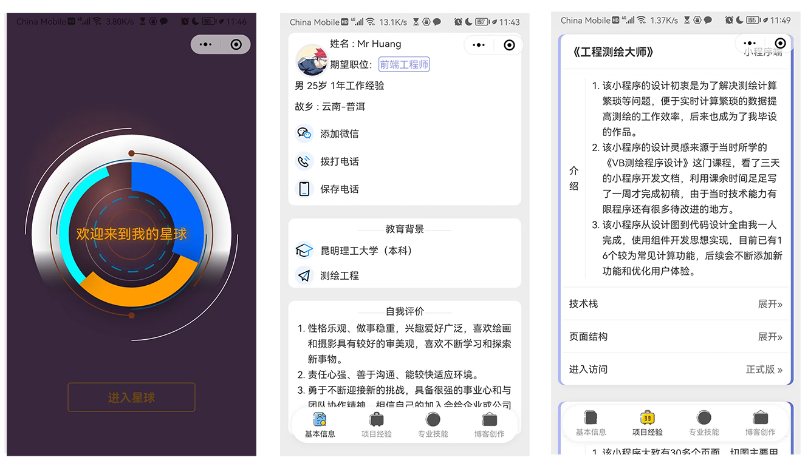
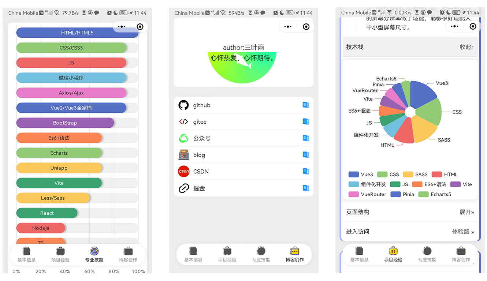
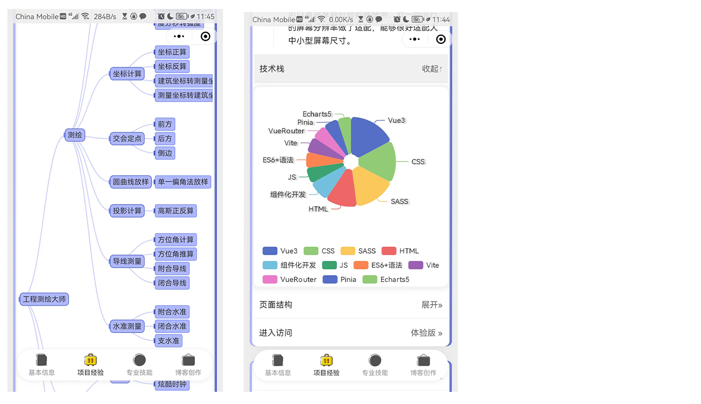

# 《极致简历》
一个简单而精致的简历微信小程序，内容主要使用Echarts5图表进行展示，适合入门与进阶。
#### 侃侃而谈
- 该小程序的设计初衷是为了给自己做一个简单的简历，总结自己所学所做的一些事情。我在网上也找了一些与简历相关的程序，但发现与简历相关的程序甚少，为了给更多的人使用和参考，所以我决定开源该小程序，主要的代码都做了详细的注释浅显易懂，使用者只需稍作修改即可使用。
- 对于想学小程序开发的朋友而言（最好具备HTML、CSS、JS基础），该小程序作为入门与进阶开发较为合适，但强烈建议先看完一遍小程序开发文档，这样收获才会最大。
- 如果您觉得该小程序还不错，请给个Star :star:  哦。
#### 设计图

#### 技术栈
- Js
- WXML
- WXSS
- SASS
- Echarts
- Es6
- 小程序API
#### 使用教程
1. git clone git@gitee.com:huangjianghuahua/resume.git
2. 打开克隆后的代码用微信开发者工具或VScode进行开发即可

